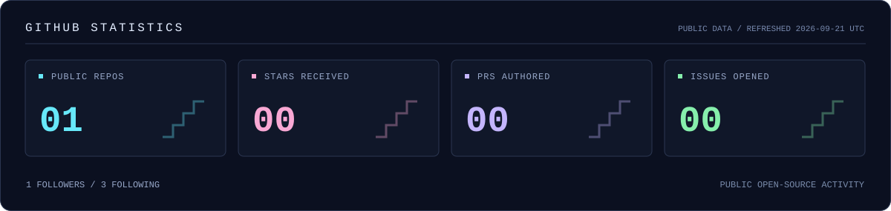

  

  
  
  

### `01` / ABOUT ME

Hi, I'm **Arnav Uplenchwar**.  
An **undergraduate student at JIIT Noida** and **vibe coder**, developing my programming skills through hands-on projects and AI-assisted development.

| CATEGORY | DETAILS |
| :--- | :--- |
| 🎓 **Education** | Undergraduate · JIIT Noida |
| 💻 **Languages** | Python · C |
| 🛠️ **Development tools** | PyCharm · Visual Studio Code · Android Studio |
| ✨ **AI coding tools** | Codex · Antigravity |
| 🎯 **Focus** | Build practical projects and strengthen programming fundamentals |

### `02` / TECHNICAL SKILLS

  
  
  
  
  
  
  

### `03` / COLLABORATION & CONTACT

Good projects start with a conversation. Have an idea, a learning challenge, or a project we could build together? **Send me a message.**

| PLATFORM | CONTACT |
| :--- | :--- |
| 📬 **Email** | [arnavuplenchwar@gmail.com](mailto:arnavuplenchwar@gmail.com) |
| 🔗 **LinkedIn** | [Arnav Uplenchwar](https://www.linkedin.com/in/arnav-uplenchwar-972562424/) |
| 💻 **GitHub** | [@ArnavUplenchwar](https://github.com/ArnavUplenchwar) |

### `04` / GITHUB ACTIVITY

  

  <a href="https://github.com/ArnavUplenchwar?tab=repositories">REPOSITORIES</a> &nbsp; · &nbsp;
  <a href="https://github.com/pulls?q=is%3Apr+author%3AArnavUplenchwar">PULL REQUESTS</a> &nbsp; · &nbsp;
  <a href="https://github.com/issues?q=is%3Aissue+author%3AArnavUplenchwar">ISSUES</a> &nbsp; · &nbsp;
  <a href="https://github.com/ArnavUplenchwar?tab=overview">CONTRIBUTIONS</a>

---

<samp>CONTINUOUS LEARNING. THOUGHTFUL DEVELOPMENT. OPEN COLLABORATION.</samp>

